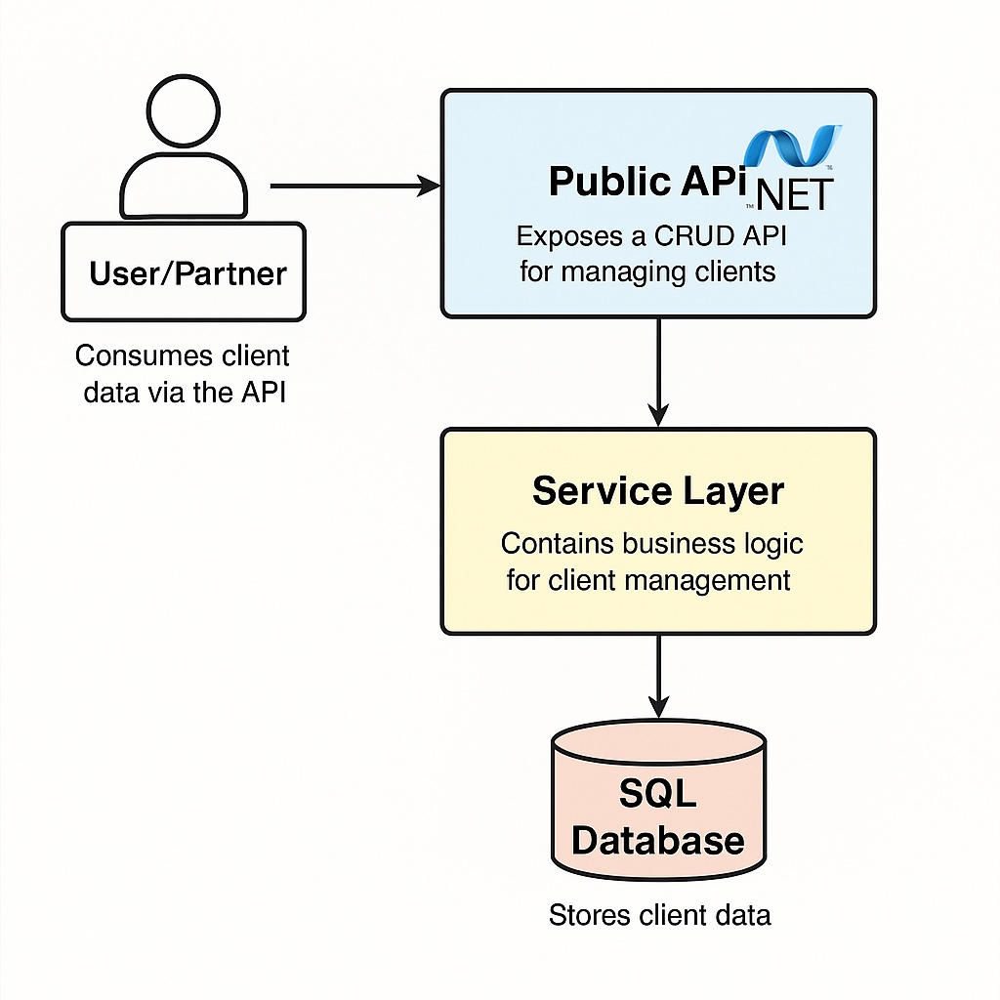

# 🧱 Projeto com Arquitetura MVC - .NET 8

## 📚 Objetivos de Ensino

Este projeto visa exercitar os seguintes conceitos:

- Fundamentos de Arquitetura de Software
- Requisitos Arquiteturais e Modelagem Arquitetural
- Design Patterns, Estilos e Padrões Arquiteturais
- Principais Arquiteturas de Software da Atualidade

---

## 🚀 Tecnologia Utilizada

- **Linguagem**: C# (.NET 8)
- **Framework**: ASP.NET Core Web API
- **Padrão Arquitetural**: MVC (Model-View-Controller)
- **Banco de Dados**: SQL Server (ou InMemory para testes)
- **ORM**: Entity Framework Core
- **Ferramentas**: Swagger, EF Core Migrations

---

## 🔧 Funcionalidades da API

- CRUD completo de Cliente
- Contagem de registros
- Busca por nome e por ID

### Endpoints Disponíveis

| Método HTTP | URI                        | Descrição                        |
|-------------|----------------------------|----------------------------------|
| GET         | /api/customers             | Lista todos os clientes          |
| GET         | /api/customers/{id}        | Retorna cliente por ID           |
| GET         | /api/customers/name/{name} | Retorna clientes por nome        |
| GET         | /api/customers/count       | Retorna total de registros       |
| POST        | /api/customers             | Cria um novo cliente             |
| PUT         | /api/customers/{id}        | Atualiza um cliente              |
| DELETE      | /api/customers/{id}        | Deleta um cliente                |

---

## 🗂️ Estrutura de Pastas do Projeto (.NET)

```plaintext
src/
└── Empresa1.Api/
    ├── Controllers/         
    ├── Models/              
    ├── ViewModels/          
    ├── Services/            
    ├── Repositories/        
    ├── Data/                
    ├── Mappings/            
    ├── Database/            
    ├── Migrations/          
    └── Program.cs           
```


---

## 🧠 Explicação dos Componentes (MVC)

| Camada         | Descrição                                                     |
| -------------- | ------------------------------------------------------------- |
| **Model**      | Define a entidade `Customer` com regras básicas.              |
| **Controller** | Exposição de endpoints REST.                                  |
| **Service**    | Contém as regras de negócio e orquestra os fluxos.            |
| **Repository** | Camada de acesso a dados com EF Core.                         |
| **ViewModel**  | Define os modelos usados para entrada e saída da API.         |
| **DbContext**  | Representação da estrutura do banco e mapeamento com EF Core. |

---

## 🧩 Diagrama Arquitetural - C4 Model

### 🔹 Nível 1 — Contexto

```plaintext
[Parceiros Externos]
        │
        ▼
[API Pública de Clientes (.NET 8)]
        │
        ▼
[Camada de Serviço]
        │
        ▼
[SQL Server]
```

### 🔹 Nível 2 — Container

```plaintext
+----------------------------+
|    ASP.NET Core API        |
+----------------------------+
            │
            ▼
+----------------------------+
|  Application Service       |
+----------------------------+
            │
            ▼
+----------------------------+
|  Repository (EF Core)      |
+----------------------------+
            │
            ▼
+----------------------------+
|       SQL Server           |
+----------------------------+

```


🖼️ Diagrama visual: ver imagem anexada ao projeto



---

### 🔹 Nível 3 — Componentes

```plaintext
CustomerService.cs
├── ValidateEmailUniqueness()
├── CreateAsync()
├── GetByIdAsync()
└── GetAllAsync()

CustomerRepository.cs
├── GetByIdAsync()
├── GetAllAsync()
├── EmailExistsAsync()
└── AddAsync()

```

### 🔹 Nível 4 — Código

```csharp
// Customer.cs
public class Customer
{
    public Guid Id { get; private set; }
    public string Name { get; private set; }
    public string Email { get; private set; }
    public string? Phone { get; private set; }
    public string? Address { get; private set; }
    public DateTime CreatedAt { get; private set; }
}

```

```csharp
// CustomerService.cs
public async Task<OperationResult<CustomerViewModel>> CreateAsync(CustomerCreateViewModel input)
{
    if (await EmailExistsAsync(input.Email))
        return OperationResult.Fail("Já existe um cliente com esse e-mail.", 409);

    var customer = new Customer(...);
    await _repository.AddAsync(customer);

    return OperationResult.Ok(new CustomerViewModel(...), 201);
}

```

## 💡 Diferenciais

- Documentação com Swagger/OpenAPI 3.0
- Adoção do C4 Model completo para comunicação arquitetural
- Aplicação dos princípios SOLID e Clean Architecture
- Camadas separadas com injeção de dependência e testes facilitados
- Mapeamento limpo com DTOs/ViewModels
- Código modular, de fácil leitura e manutenção

---

## ✅ Requisitos Atendidos

- ✅ API REST com endpoints CRUD
- ✅ Padrão MVC aplicado
- ✅ Diagrama C4 entregue
- ✅ Explicação dos componentes
- ✅ Persistência implementada com EF Core
- ✅ Banco com Migrations
- ✅ Swagger documentando a API

---

## 🔗 Link do Projeto (opcional)

Caso deseje: [https://github.com/vitor-itsolution/arquiteto-software-desafio-final](https://github.com/vitor-itsolution/arquiteto-software-desafio-final)

